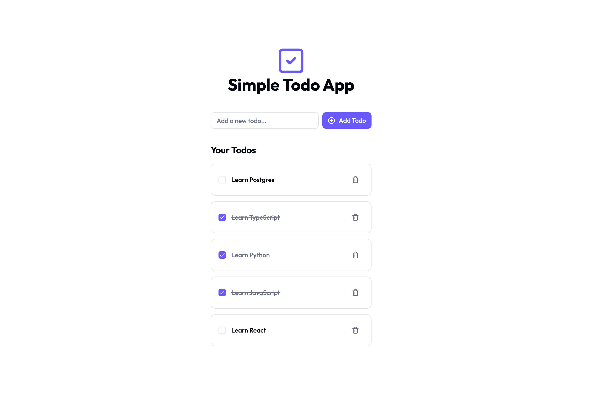

This is a simple Todo app built with Next.js, TypeScript, Tailwind CSS, Drizzle, and Postgres.

<div align="center">
    
</div>

## Getting Started

To get started, clone the repository and install the dependencies:

```bash
git clone git@github.com:drbarzaga/nextjs-todo-app.git
cd nextjs-todo-app
pnpm install
```

## Database

We are using Postgres for the database, we recommend use Neon as Serverless Postgres Database.
If you don't have a Neon account, you can create one [here](https://neon.tech), after that, you
can create a new project and a new database.

## Environment Variables

Create a `.env` file in the root of the project and add the following environment variables:

```bash
DATABASE_URL=your-neon-database-url
```

## Database Migrations

To create the database tables, run the following command:

```bash
pnpm run db:push
```

## Running the Development Server

To start the development server, run the following command:

```bash
pnpm run dev
```

Open [http://localhost:3000](http://localhost:3000) with your browser to see the result.

## Important

If you make changes to the database schema, you need to run the following command to update the database:

```bash
pnpm run db:push
```

If you want to look at the database, you can Drizzle Studio in your local machine running the following command:

```bash
pnpm run db:studio
```

And open [https://local.drizzle.studio](https://local.drizzle.studio) with your browser.
